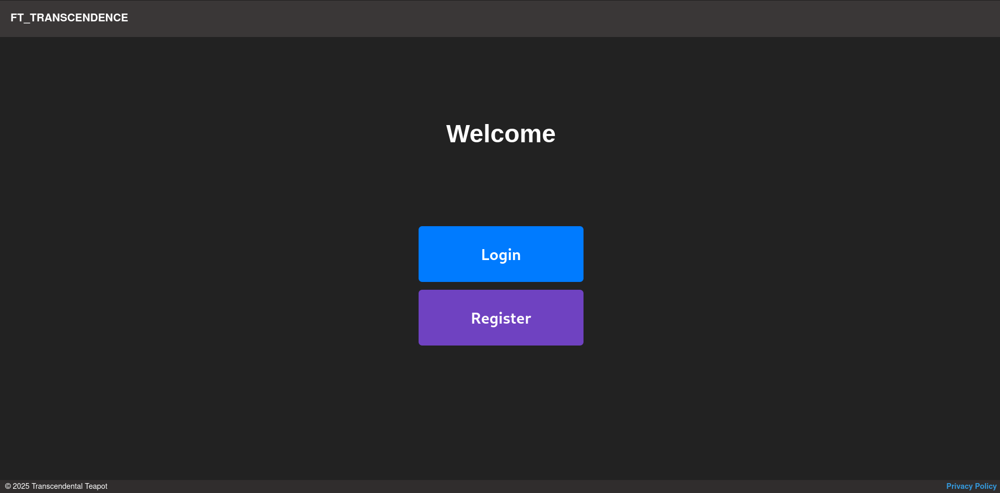

# Ft_Transcendence

### Table of Content
- [Introduction](#introduction)
- [Description](#description)
- [The Project](#the-project)
- [Quick start](#quick-start)
- [Usage](#usage)


## Introduction
This project is the final projet of the 42 common core. As the subject states, we have the possibility to choose up to 7 major modules to complete it.
I did this project with [@Lapinew](https://github.com/Lapinew) and [@gkubina](https://github.com/gkubina).

TL;DR, This is a web application built using the Vuejs and Django framework. It features a server-side implementation of the classic Pong game, designed with a microservices architecture using docker. The application supports remote players, user management, implementation of Two-Factor Authentication (2FA) and JWT, a remote authentication with 42, multiple languages and themes.
Additionally, it includes advanced features such as AI opponents locally and live chat.

## Description
**Major Modules**
- **Framework:** The project is built using the Django framework.
- **Microservices Architecture:** The backend is designed as microservices to enhance scalability and maintainability.
- **Remote Players:** Supports gameplay with remote players.
- **User Management:** Includes standard user management, authentication, and user handling across tournaments.
- **Remote Authentication:** Implements remote authentication to enhance gameplay and user experience.
- **Additional Game:** Adds another game with user history and matchmaking features.
- **AI Opponent:** Introduces an AI opponent for single-player mode.
- **Live Chat:** Integrates a live chat feature for real-time communication.
- **2FA and JWT:** Implement Two-Factor Authentication (2FA) and JWT.

**Minor Modules**
- **Database:** Uses PostgreSQL for the backend database.
- **Multiple Language Support:** Supports multiple languages to cater to a diverse user base (3 languages: english, french and german).
- **User and Game Stats Dashboards:** Provides dashboards for user and game statistics.
- **Monitoring system:** establish a robust monitoring infrastructure using Prometheus and Grafana , enabling real-time visibility into system metrics.

## The Project
##### Welcome page

##### Register page

##### Login page
*The OTP is not mandatory, if you didn't activate it you don't have to put anything in it*

##### Profile (stat) page


###### history

###### friends

##### Settings (account) page


###### appearance

###### languages
*If the languange isn't changing refresh the page, the language should have been change !*

##### Play page

##### Pong modes page
*You can either play against an AI (solo), play against someone that is beside you, play against a friend in a private room remotely or in a local tournament of four people*

##### Play with friend

##### Pong page

##### Tic Tac Toe modes page
*You can either play against an AI (solo) or against someone else present with you (local)*

##### Tic Tac Toe page
*This version of tic-tac-toe is an infinite tic-tac-toe. You can only have three pieces on the board at any given time. When you place your fourth piece, the first piece you placed will disappear. This allows the game to continue indefinitely, and players must strategically place their pieces to either win or prevent losing.*


<!-- video walkthrough of the website -->

## Quick Start
```
git clone git@github.com:KoganeShiro/ft_transcendence.git
cd ft_transcendence
```

## Usage
If you don't have make or docker and docker-compose installed, you should in order to compile and run this project

Another things you should have is the .env file
Those are the credential to be able to access the backend of this project

If you did, then you can make and follow the instruction !

```
make up
```
